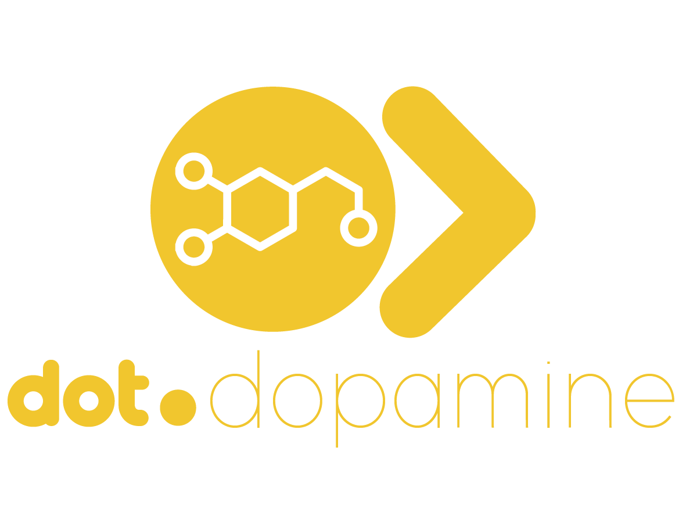

<div align="center">



<br /><br />

**The Dot Ecosystem's ethical engagement intelligence engine.**

<br />

   

<br /><br />

**Part of the Dot Ecosystem** &nbsp;·&nbsp; `dopemine.infodot.app`

</div>

---

## The rule, stated first

**Dot.Dopemine never optimizes for addiction or screen time.** It optimizes only for learning,
achievement, business growth, mastery, productivity, community, purpose, confidence, momentum,
habit formation, and progress.

This isn't a values statement bolted onto a growth-hacking product. It's the whole product: a
catalog of engagement mechanics that other Dot Ecosystem platforms consume as a service, so that
"make this feature more engaging" has one accountable, ethically-audited answer instead of twenty
platforms independently reinventing streaks and leaderboards — some of them badly.

The catalog carries the highest governance stakes in the ecosystem, because its literal product is
the mechanism the ecosystem exists to keep in check. So it doesn't get an exemption from the
ethics constraint — it gets the strictest possible reading of it:

- **A mechanic's category is not free text.** `App\Enums\MechanicCategory` is a fixed, exhaustive
  PHP backed enum (`progress`, `achievement`, `mastery`, `community`, `momentum`, `purpose`,
  `learning`, `confidence`). There is no case for a loss-framed streak, a leaderboard, a
  variable-ratio reward, or a FOMO nudge — so none can be created, not because a validator rejects
  the string, but because no such value exists to assign.
- **Certification requires a recorded, passing acid-test verdict**, enforced twice: once by
  `App\Actions\Dopemine\CertifyMechanic` (the intended path) and again by a `saving` listener on
  `App\Models\Mechanic` itself (the backstop — holds even against direct mass assignment, tinker,
  or a future entry point nobody remembers to gate).
- **The prohibited-metric list is published, not just documented** — see `ProhibitedMetricPattern`,
  seeded from `wiki.md` §6, rendered on the dashboard.

Prohibited today, structurally: raw engagement volume as a target, individual streaks with loss
framing, person-vs-person leaderboards on rate metrics, variable-ratio reward schedules, and
abandonment/re-engagement pressure nudges. Full reasoning and evidence in `wiki.md` §6.

## Status

**Hand-authored, unverified scaffolding.** This codebase was written by an AI agent in an
environment with no PHP, Composer, or PostgreSQL available — nothing here has been run, migrated,
or tested by executing it. Every file was hand-written and hand-reviewed for correctness against
Laravel/Jetstream conventions, but until someone runs `composer install && php artisan test`
against it, treat it as a careful draft, not a working build.

## Domain Model

| Entity | Tenancy | Notes |
|---|---|---|
| `Mechanic` | **Global** | The catalog itself — shared across every consuming platform, same reasoning as Dot.Design's shared token/component library. `category` and `status` are fixed enums; `acid_test_passed` gates certification. |
| `MechanicDeployment` | **Team-scoped** (`team_id`) | Which team is using which certified mechanic, and since when. Can only be created against a `certified` mechanic. |
| `ProhibitedMetricPattern` | **Global** | The negative catalog — read-mostly, rendered on the dashboard so the restraint is visible, not just documented. |

Action classes (`app/Actions/Dopemine/`) carry the workflows: `CertifyMechanic`,
`DecertifyMechanic`, `DeployMechanic`, `RetireMechanicDeployment` — mirroring the
`app/Actions/Jetstream/` pattern already used for team actions in this codebase.

## Core Features (MVP)

- Jetstream Teams shell (auth, teams, 2FA, API tokens, ecosystem SSO handoff) — copied verbatim
  from Dot.Billing's already-reviewed boilerplate, adapted only for branding
- Mechanic Catalog dashboard — browse certified/proposed/decertified mechanics by category
- Certify / decertify workflow (stands in for a dedicated Ethics Officer role — see Open Questions)
- Team deployment tracking — deploy a certified mechanic to your team, retire it later
- Feature tests asserting the ethics gate holds at both the action and model layers

## Not in this MVP

The full paired engagement/outcome ledger (`wiki.md` §3 "Wellbeing & Outcome Ledger"), the
cross-platform Knowledge Pack ingestion pipeline, and mandatory prohibited-list distribution to
other platforms are architecture, not code, in this pass. See `wiki.md` Roadmap.

## Tech Stack

| Layer | Technology |
|---|---|
| Framework | Laravel 12 (`^13.8` per composer.json — see wiki.md for the version note) |
| Language | PHP 8.3+ |
| Frontend | Livewire 3 · Alpine.js 3 · Tailwind CSS |
| Database | PostgreSQL (shared across ecosystem) |
| Auth | Laravel Sanctum (ecosystem SSO) + Jetstream/Fortify (teams, 2FA) |

## Quick Start

```bash
git clone <this repo>
cd Dot.Dopemine
cp .env.example .env
composer install
npm install && npm run build
php artisan key:generate
php artisan migrate
php artisan db:seed --class=Database\\Seeders\\MechanicCatalogSeeder
php artisan serve
```

None of the above has been executed in this repository's current state — no PHP toolchain was
available while it was authored. Treat first-run failures as expected until someone verifies it.

### Running Tests

```bash
php artisan test
```

`tests/Feature/Dopemine/EthicsGateTest.php` is the test suite that matters most here — it asserts
the ethics constraint is structurally enforced, not merely documented.

## Ecosystem

**Dot.Dopemine** is one of the platforms in the Dot Ecosystem, unified by [Dot.Brain](https://github.com/sakhilebhayi/Dot.Brain).
See this repository's `wiki.md` for the platform's own architecture blueprint, and
[`Dot.Brain/platforms/dot-dopemine.md`](https://github.com/sakhilebhayi/Dot.Brain/blob/main/platforms/dot-dopemine.md)
for Dot.Brain's ingested view.

## License

MIT
