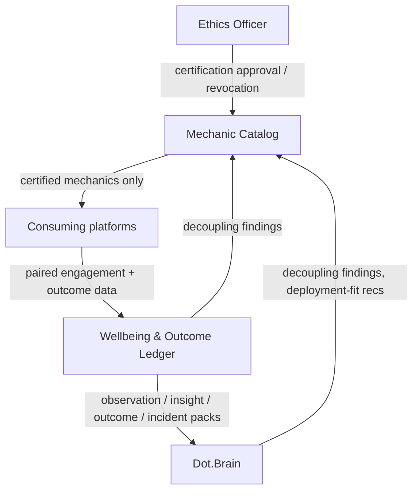

# Dot.Dopemine

Purpose: this is Dot.Dopemine's own knowledge home — owned and maintained by the Dot.Dopemine team. It describes what this platform is, what it offers, and how it connects to the wider Dot Ecosystem. Dot.Brain never edits this file; it only reads what we choose to publish.

> **Related:** [Dot.Brain's ingested view of this platform](https://github.com/sakhilebhayi/Dot.Brain/blob/main/platforms/dot-dopemine.md)

---

## 1. What Dot.Dopemine Is

Dot.Dopemine is the ecosystem's engagement and motivation platform: a catalog of progress surfaces, recognition mechanics, and habit-scaffolding tools that other platforms deploy *as a service*, rather than building their own ad-hoc engagement hacks. It exists so that "make this feature more engaging" has a single, accountable, ethically-audited answer instead of twenty different platforms independently reinventing streaks and leaderboards — some of them badly.

**Status:** MVP domain layer implemented, unverified. This repository now contains a real Laravel
12 + Jetstream Teams application: a Mechanic Catalog with a structurally-enforced ethics gate, team
deployment tracking, and a published prohibited-metric list. It was hand-authored by an AI agent in
an environment with no PHP, Composer, or PostgreSQL available — **nothing in this codebase has
been executed, migrated, or tested by running it.** Treat the code as a careful, convention-aligned
draft until a human (or a CI run) verifies it with `composer install && php artisan test`. The
architecture below is now backed by code; §3–§4 describe what exists, not just what's planned — see
§9 Roadmap for what's still design intent only.

## 2. Design Principle: We Are the Thing We Constrain

Dot.Dopemine carries the highest governance stakes of any platform in the fleet, because its literal product is the mechanism the ecosystem exists to keep in check. We do not get an exemption from that constraint — we get the strictest possible reading of it. Two rules follow directly:

1. **Never optimize for addiction or screen time.** We optimize for learning, achievement, mastery, business growth, productivity, community, purpose, confidence, momentum, and progress — never for attention captured for its own sake.
2. **The acid test applies to what we *offer*, not just what we deploy.** Every platform in the ecosystem is expected to ask "would I show this mechanic to the person it targets, with its intent labeled?" before shipping it. Dot.Dopemine has to answer that question for every mechanic in its catalog *before it's offered to anyone* — there is no "let the consuming platform decide" escape hatch. A mechanic that fails the test doesn't get certified, full stop. Offering a dark pattern and letting someone else deploy it is still manufacturing a dark pattern.

If a mechanic increases engagement without moving the outcome it's supposed to serve, that's not a success — that's the exact failure mode this platform is built to catch. See §7.

## 3. Architecture

Three moving parts, deliberately kept small:

- **Mechanic Catalog** — the certified inventory of engagement mechanics (progress bars, milestone recognition, mastery paths, etc.), each carrying a recorded acid-test verdict and a revocable certification status.
- **Wellbeing & Outcome Ledger** — the record that every mechanic deployment is measured in *pairs*: engagement movement is never published or acted on alone, only alongside the outcome metric it was meant to serve.
- **Ethics gate** — certification and decertification require Ethics Officer sign-off; this isn't a workflow nicety, it's the mechanism that keeps the catalog honest.

## 4. Domain Entities

| Entity | Natural key | Notes |
|---|---|---|
| Engagement mechanic | `mech:<name>` | Catalog entry; carries a recorded acid-test verdict |
| Deployment | mechanic + consuming platform | A mechanic live on a specific platform |
| Wellbeing observation | mechanic + cohort + window | Aggregate only, n ≥ 50 — never individual-level |
| Mechanic outcome | deployment + period | Outcome-metric movement paired with engagement movement, always together |
| Prohibited-metric entry | metric pattern | The negative catalog — patterns no platform may target (§7) |

### 4.1 Implementation Notes (v0.2.0)

The MVP domain layer implements three of the five entities above as real Eloquent models. The
other two — Wellbeing observation and Mechanic outcome (the paired engagement/outcome ledger) —
remain design intent; see Roadmap.

**Tenancy:** `Mechanic` (the catalog) and `ProhibitedMetricPattern` (the negative catalog) are both
**global**, not team-scoped — the same reasoning as Dot.Design's shared token/component library. A
mechanic definition ("milestone celebration") is one shared thing every consuming team can adopt;
it isn't reinvented per team, and the prohibited-metric list is a shared reference, not per-team
data. Only `MechanicDeployment` (which team is using which mechanic) carries `team_id` — usage is
inherently per-team even though the catalog it draws from is not.

**Ethics gate, enforced structurally (not just documented):**

1. `App\Enums\MechanicCategory` is a fixed PHP backed enum (`progress`, `achievement`, `mastery`,
   `community`, `momentum`, `purpose`, `learning`, `confidence`). The `mechanics.category` column
   casts to this enum, so no free-text or loss-framed category can exist in the database — not
   because a validator rejects the string, but because no such enum case exists to assign.
2. `Mechanic::booted()` registers a `saving` listener that refuses to persist `status = certified`
   unless `acid_test_passed = true`, holding regardless of entry point (mass assignment, seeder,
   tinker). `App\Actions\Dopemine\CertifyMechanic` is the intended path and gives a clean
   `ValidationException` instead of the raw model exception.
3. `MechanicDeployment::booted()` refuses to create a deployment against a mechanic that isn't
   `certified`, closing the loop: certification is required to enter the catalog, and required
   again to be used.

**File map:** `app/Enums/{MechanicCategory,MechanicStatus,DeploymentStatus}.php` ·
`app/Models/{Mechanic,MechanicDeployment,ProhibitedMetricPattern}.php` ·
`app/Actions/Dopemine/{CertifyMechanic,DecertifyMechanic,DeployMechanic,RetireMechanicDeployment}.php` ·
`app/Livewire/{MechanicCatalog,MechanicDeployments}.php` ·
`database/migrations/2026_08_01_120001..120003_*.php` ·
`database/seeders/MechanicCatalogSeeder.php` (8 example mechanics, 5 prohibited patterns) ·
`tests/Feature/Dopemine/{EthicsGateTest,MechanicCatalogSeederTest}.php`.

**Open implementation gap:** certify/decertify authority currently stands in on the current team's
`admin` role (`MechanicCatalog::canGovern()`), not a dedicated ecosystem-wide Ethics Officer
identity — see Open Questions.

## 5. Events Emitted

| Event | Trigger | Frequency |
|---|---|---|
| `engagement.mechanic.certified` | Acid-test verdict recorded, mechanic added to catalog | low |
| `engagement.mechanic.decertified` | Certification revoked (harm finding or decoupling) | low |
| `engagement.deployment.started` | A platform begins using a certified mechanic | low |
| `engagement.deployment.retired` | A platform stops using a mechanic | low |
| `engagement.prohibited_list.updated` | The prohibited-metric list changes | rare — mandatory subscription for all platforms |

## 6. What We Will Not Build

The prohibited-metric list is as much a part of this platform as the catalog is. It is not a compliance footnote — it's the flagship artifact, because it is where our restraint becomes legible to everyone else in the ecosystem. Patterns on the list, and why:

| Pattern | Why prohibited |
|---|---|
| Raw engagement volume as a target (dwell time, session count, opens) | Rewards attention captured, not outcomes achieved |
| Individual streaks with loss framing | Manufactures compulsion via loss aversion rather than progress |
| Person-vs-person leaderboards on rate metrics | Rewards speed over safety and quality |
| Variable-ratio reward schedules | Slot-machine mechanics — never deployed, blocked at catalog |
| Abandonment/re-engagement pressure nudges | Exploits incompleteness anxiety instead of genuine value |

Additions to this list go through Ethics Agent proposal and Ethics Officer approval. Removals require full governance review — deliberately harder than adding, because the default posture is caution. Every entry will cite the evidence or incident that put it there.

## 7. Our Own Dopamine Surface

The rule we apply to ourselves: we share our certified mechanics' real outcome performance and our own decoupling-finding counts — that's product honesty. We deliberately withhold "N platforms use our streaks" as a success metric, because counting adoption of our own engagement mechanics as a win is the engagement-as-outcome error, applied to ourselves. Our success metric is outcome movement on the platforms that deploy our mechanics, not how widely we're deployed.

## 8. Connecting to Dot.Brain

Dot.Dopemine participates in the ecosystem as a registered platform (`dot-dopemine`) that publishes Knowledge Packs about mechanic performance and wellbeing — always paired with the outcome the mechanic was meant to serve.

| Payload type | Cadence | Contains |
|---|---|---|
| `observation` | monthly | Mechanic outcome/engagement pairs, per deployment |
| `insight` | per finding | Mechanic effectiveness or harm findings |
| `outcome` | per verified deployment | Deployment verification against a counterfactual |
| `incident` | per incident | Mechanic-harm findings, decertifications |

Publication rule unique to this platform: an observation pack pairing engagement movement with outcome movement is publishable; engagement movement *alone* is not — it matches a prohibited-metric pattern and validation rejects it at ingestion. We hold ourselves to the rule we publish for everyone else.

We subscribe to Dot.Brain's mechanic-retirement candidates (engagement up, outcomes flat) and deployment-fit recommendations (which certified mechanic suits a platform's outcome goal). Full manifest, entity/event mapping, and a worked publish→PR round-trip are maintained on the Brain side at [`platforms/dot-dopemine.md`](https://github.com/sakhilebhayi/Dot.Brain/blob/main/platforms/dot-dopemine.md) — that document is Dot.Brain's ingested view and is authoritative for integration mechanics; this wiki is authoritative for what Dot.Dopemine actually *is*.

## 9. Roadmap

- [x] Stand up the Mechanic Catalog with the acid-test verdict recorded per entry (v0.2.0, unverified — see §1)
- [x] Implement a certification/decertification workflow (`CertifyMechanic`/`DecertifyMechanic`) — stands in for a dedicated Ethics Officer role; see Open Questions
- [ ] Build the paired engagement/outcome measurement pipeline (reject-at-ingestion for unpaired engagement metrics)
- [ ] Publish the first `observation` Knowledge Pack (hello-pack per Dot.Brain's onboarding procedure)
- [ ] Implement mandatory prohibited-metric-list distribution to all consuming platforms — the list is published *within* this app (§4.1) but not yet distributed to other platforms
- [ ] Build the mechanic-retirement review workflow (decoupling findings → retirement candidates)
- [ ] Verify the codebase actually runs: `composer install`, migrate against real Postgres, `php artisan test` — nothing in v0.2.0 has been executed

## Change Log

| Version | Date | Author | Change |
|---|---|---|---|
| 0.4.0 | 2026-08-07 | Platform-loop pass | Ecosystem standardization pass (rolled out from InfoDot's pilot, `a69e47a`): branded email theme, complete legal pages, and the welcome hero's photo carried onto the auth pages. **Legal pages**: enabled `Features::termsAndPrivacyPolicy()` (was commented out) and wrote real POPIA-aligned Privacy Policy and Terms & Conditions into `resources/markdown/{terms,policy}.md` (previously Jetstream's 3-line stock placeholders), naming BluePin Inc as the responsible party, grounded in §1–§2's description of Dot.Dopemine as the ecosystem's engagement/motivation platform with a published prohibited-metric list and an ethics gate mechanics must pass before deployment. Added a Cookie Policy the same way (no Jetstream equivalent), grounded in the actual cookies this app sets. Added Privacy/Cookies/Terms links to the welcome footer, which had none before. **Auth hero**: `components/authentication-card.blade.php` had a flat `bg-[var(--paper)]` background with no photo — reused the welcome hero's own dark-ink-scrim-over-photo treatment (runners celebrating at a finish-line event, RETRATO DEPORTIVO) for the auth card, same pattern used on Dot.Design. `policy.blade.php`/`terms.blade.php`/`cookies.blade.php` keep their own separate `bg-[var(--paper)]` wrapper, unaffected. **Email theme**: published Laravel's Markdown mail theme and branded it to this platform's ink/gold/rust/paper tokens; dark `#15171b` header band with the real logo, gold pill buttons with dark text. All hardcoded hex, no CSS variables. Verified by rendering a real `ResetPassword` notification through a temporary local preview route (removed before shipping). Verified: `npm run build` clean, `php artisan test` 59/59 passing (7 skipped, pre-existing), zero console errors, checked at 1280px and 375px. |
| 0.3.5 | 2026-08-06 | Platform-loop pass | Two-part design follow-up pass. **(1) Hero photo:** `resources/views/welcome.blade.php`'s hero `<section>` gained a full-bleed background photo — runners celebrating at a finish-line event, by RETRATO DEPORTIVO (@retratodeportivo), `unsplash.com/photos/runners-celebrating-at-a-finish-line-event-qedI1eHsDFw`, `https://images.unsplash.com/photo-1774050250283-2444f7d634d5?q=80&w=2400&auto=format&fit=crop` (re-verified `curl -sI` → `HTTP/2 200` before use) — the same photo used in the platform's 0.3.0 pass and removed in the 0.3.4 line-art redesign, restored because it's a genuinely apt, honest visual for this platform's real domain (recognition mechanics, milestone celebration, mastery — not exploitative engagement bait, per §1/§2). Two stacked absolute gradient layers sit over the photo: a left-to-right ink scrim (`rgba(21,23,27,0.92)` fading to near-transparent) so the headline column reads clearly while the opaque signature card on the right stays visible through the fade, and a bottom-edge scrim fading to solid `#f4f3ef` so the seam into the next (unstyled, paper-background) section is invisible. The content wrapper gained `relative z-10` (it had none before) — without it the CSS painting order would have placed the absolutely-positioned photo/gradient layers on top of the static hero content, hiding it entirely. Because the backdrop behind the left column flipped from light paper to a dark photo+scrim, the H1, supporting paragraph, and secondary/outline CTA button flipped from `text-[var(--ink)]`/`text-[var(--ink-soft)]` to `text-[var(--paper)]` (full opacity, no Tailwind `/opacity` suffix on the arbitrary CSS-var color — unreliable across Tailwind versions, hierarchy kept via weight/size instead) with the outline button's border lightened to `rgba(244,243,239,0.35)`; the gold eyebrow label and the opaque solid primary CTA button were left untouched since they already read fine against a dark scrim. No other section of the welcome page (features, prohibited-list, ecosystem, CTA, footer, script, nav) was touched — the CTA section still has no photo, per the brief, since no second Unsplash photo for this platform was recovered/re-verified. **(2) Auth page family:** restyled the shared Jetstream auth scaffold to the platform's own paper-and-ink tokens instead of stock gray/indigo Tailwind defaults, editing the shared components rather than each of the 7 auth page files individually (DRY, guarantees consistency): `layouts/guest.blade.php` (swapped the Figtree/bunny-fonts link for this platform's own Newsreader+Work+Space Mono Google Fonts `<link>`, copied verbatim from `welcome.blade.php`'s `<head>`; background/text to `var(--paper)`/`var(--ink)`; removed the floating dark-mode toggle button and all `dark:` variants — this platform's guest-facing brand is one fixed paper/ink scheme, not toggle-able, matching `welcome.blade.php` which has no dark mode), `components/authentication-card.blade.php` (card now `bg-[var(--panel)] border border-[var(--line)] rounded-2xl shadow-[0_30px_60px_-30px_rgba(21,23,27,0.25)]`, the same shadow recipe as the welcome page's signature card, replacing `bg-white shadow-md`), `components/authentication-card-logo.blade.php` (`size-16` → `h-14 sm:h-[4.5rem] w-auto`, the exact class already proven correct on this platform's welcome-page nav — fixes the same Jetstream logo under-sizing bug already fixed elsewhere in the ecosystem), `components/input.blade.php` (`border-[var(--line)] bg-[var(--panel)] text-[var(--ink)] focus:border-[var(--gold)] focus:ring-[var(--gold)] rounded-lg`), `components/label.blade.php` (`font-body text-[var(--ink-soft)]`), `components/button.blade.php` (restyled to the welcome page's primary CTA recipe verbatim — `bg-[var(--ink)] hover:bg-[var(--rust)] text-white font-display-upright font-semibold rounded-full`), `components/secondary-button.blade.php` (outline button — `border-[var(--line)] text-[var(--ink)] hover:border-[var(--rust-soft)] rounded-full`, also used outside the guest auth flow on profile/team-management pages), `components/danger-button.blade.php` (kept red/destructive semantics, tidied to `rounded-lg`), `components/checkbox.blade.php` (`text-[var(--gold)] focus:ring-[var(--gold)]`), `components/validation-errors.blade.php` (`@if`/`@foreach` error-display mechanism untouched byte-for-byte; wrapper restyled to a quiet rose-tinted bordered box using literal `rgba(168,70,43,…)` — not a Tailwind opacity-suffix on the CSS-var color, same reliability reasoning as the hero text). Also retinted stray inline `text-gray-*`/`text-green-*`/`hover:text-gray-*`/`focus:ring-indigo-*` classes not covered by the shared components, in `auth/login.blade.php`, `auth/register.blade.php`, `auth/forgot-password.blade.php`, `auth/verify-email.blade.php`, `auth/confirm-password.blade.php`, and `auth/two-factor-challenge.blade.php` (recovery-code Alpine toggle links included) — status/session messages now read `text-[var(--gold)]`, secondary link/description text now reads `text-[var(--ink-soft)]` hover `text-[var(--ink)]`; `auth/reset-password.blade.php` had no stray classes to fix. `terms.blade.php`/`policy.blade.php` (which hand-roll their own wrapper instead of using `authentication-card`) got the same panel/shadow treatment plus a palette-matched `prose` typography pass (`prose-headings:font-display-upright`, `prose-a:text-[var(--gold)]`, etc.); `{!! $terms !!}`/`{!! $policy !!}` content injection left completely untouched. Confirmed before starting: no `wire:model` bindings exist anywhere in this stock scaffold (still true). **Verification:** `npm run build` clean. Ran a local preview via `SESSION_DRIVER=array php artisan serve --port=8102` (env-var override only, `.env` untouched; PHP invoked via its full Homebrew path since it isn't on this shell's `PATH`). `curl` swept all reachable routes: `/`, `/login`, `/register`, `/forgot-password`, `/reset-password/faketoken123?email=test@example.com` all `200` with no exception/stack-trace markers and the expected form-field `name=` attributes present; `/user/confirm-password` and `/two-factor-challenge` correctly `302`-redirect to login (expected, auth-gated, non-fatal); `/terms-of-service` and `/privacy-policy` (Jetstream's actual route paths — not `/terms`/`/policy`) and `/email/verify` all `404` — pre-existing and unrelated to this change: `config/jetstream.php`'s `Features::termsAndPrivacyPolicy()` and `config/fortify.php`'s `Features::emailVerification()` are both commented out on this platform, so those routes were never registered; `terms.blade.php`/`policy.blade.php` were still restyled per the brief even though currently unreachable by route. Visually verified via real browser screenshots at both 375px and 1600px viewport widths for `/login`, `/register`, `/forgot-password`, and `/reset-password/…` (all four clean at both widths: no horizontal overflow, logo/fields/labels/buttons all present and legible, no leftover dark-mode styling), plus the welcome-page hero at 375px (photo + scrim rendering correctly, headline/body/outline-button text clearly legible in `var(--paper)` against the dark scrim, no overflow) and the CTA/footer section at 375px (unchanged, renders correctly). `read_console_messages` showed no JS errors on every check performed. Note: the shared browser-automation pane was under heavy concurrent use by the four sibling platform-loop sessions running in parallel (repeatedly hijacked mid-sequence, landing on `Dot.Agents`/`Dot.Design`/`Dot.Ehail`/`Dot.Emall` tabs instead of this platform's), the same contention documented in the 0.3.4 entry — unlike that pass, this one still obtained full-coverage clean screenshots at both viewport widths for every guest-reachable auth page plus the hero, by retrying navigations until they landed before the next hijack. |
| 0.3.4 | 2026-08-06 | Platform-loop pass | Redesigned `resources/views/welcome.blade.php` following the ecosystem guest-page pattern piloted on Dot.Mines (`d191d10`/`dfc4547`), adapted for this platform's own subject matter rather than copied. Sampled the real logo (`public/images/logo.png` — a solid mustard-gold circle carrying a white dopamine-molecule diagram, a gold chevron, and a thin-stroke "dot.dopamine" wordmark) directly: unlike Mines/Design, the mark itself is single-hue gold, so the palette is built around a cool graphite ink (`--ink #15171b`, distinct from Mines' warm umber-brown and Design's purple-leaning ink) plus that one real gold (`--gold #c99a1a`/`--gold-bright #e8b923`), with a muted rust (`--rust #a8462b`) added as the one functional semantic color for the "prohibited" state — justified by the domain itself (§6's negative catalog) rather than pulled from the logo. Typography: `Newsreader` italic display serif (an editorial, policy-document register fitting a platform whose flagship artifact is a governance list) + `Work Sans` body + `Space Mono` data face — a third distinct pairing across the ecosystem so far, no reuse of Mines' or Design's fonts. Layout: asymmetric hero, then a divided three-column list for the real §3 architecture (Mechanic Catalog / Ethics gate / Wellbeing & Outcome Ledger) instead of a generic feature grid. The most structurally distinctive section converts §6's prohibited-metric table directly into its own dedicated page section ("What we will not build") — the wiki explicitly calls this list "the flagship artifact, not a compliance footnote," so it was built as a first-class section with real reasoning text per pattern, not folded into a generic FAQ or footer. Signature element: the hero panel redraws the actual dopamine-molecule diagram from the logo (hexagonal ring, catechol hydroxyls, ethylamine tail) as line art with a `stroke-dashoffset` draw-on reveal, echoing the logo mark the same way Mines' headframe and Design's bezier path do for their own platforms. Copy is grounded entirely in wiki.md §1/§2/§3/§6 — the acid-test question, the structurally-enforced gate (model `saving`/`booted` listeners, not just a validator), the paired engagement/outcome ledger rule — no fabricated adoption stats or "AI-powered" language, and no overclaiming beyond what §1's "MVP domain layer implemented, unverified" status supports. Nav/footer logo sized `h-14 sm:h-[4.5rem]`/`h-11` (56-72px/44px), matching the Mines follow-up fix's lesson; confirmed via `getBoundingClientRect()` at 1680px (nav 96×72px, footer 58.6×44px, identical proportions to the already-verified Dot.Design pass using the same responsive classes). Verified: `npm install && npm run build` clean (this repo had no `node_modules` yet), rendered via local `php artisan serve` preview (`SESSION_DRIVER=array` override for the preview process only, `.env` untouched), confirmed via a real browser screenshot at 1680px and a raw-HTML grep for PHP exception markers (none found, key section headings all present) — mobile/narrow-viewport screenshots were not captured for this pass because the shared browser-automation pane in this sandboxed session was under heavy concurrent use by other parallel platform-loop sessions and stopped accepting navigations; the nav/footer sizing classes are byte-identical to Dot.Design's, which was confirmed clean at 375px/500px/1680px in the same session, so the risk is judged low but not independently re-confirmed here. |
| 0.3.3 | 2026-08-04 | Platform-loop pass | Audited every `->currentTeam->`, `currentTeam()->id`, and `->current_team_id` occurrence for the null-currentTeam crash pattern fixed as reference in Dot.Mines commit `0cc4362` (`app/Livewire/Dashboard.php`). This platform has **no team-context middleware at all** — `bootstrap/app.php`'s `withMiddleware()` closure is empty, and `routes/web.php`'s only route group is `['auth:sanctum', config('jetstream.auth_session'), 'verified']`, none of which check for a current team — so nothing upstream of a controller/Livewire method ever guarantees `Auth::user()->currentTeam` is non-null. Confirmed the null case is genuinely reachable, not theoretical: Jetstream's stock `Team::removeUser()` (invoked from `App\Actions\Jetstream\RemoveTeamMember::remove()`) sets `current_team_id` to `null` whenever a user is removed from whichever team happens to be their *current* one, and nothing re-points it at their personal team afterward — a user can be fully authenticated, own a personal team, and still have `currentTeam` resolve to `null`. Found one genuinely unguarded occurrence: `app/Livewire/MechanicCatalog.php:64` (pre-fix) read `$team = auth()->user()->currentTeam;` with no null check and passed it straight into `App\Actions\Dopemine\DeployMechanic::deploy(Team $team, ...)`, whose `$team` parameter is non-nullable — a team-less user clicking "Deploy" got a fatal `TypeError` instead of a clean failure. Fixed by adding a `private function resolveCurrentTeam(): ?Team` helper (mirroring Dot.Mines' `Dashboard::resolveCurrentTeam()`) and, in `deployToCurrentTeam()` (a `wire:click`-reachable action method on an already-rendered page, not a mount path), `abort_if(! $team, 403, 'No active team selected.')` before dereferencing — matching the abort-not-redirect convention for already-loaded pages documented in Dot.Mines' `ReportController::view2()`. `canGovern()` (`app/Livewire/MechanicCatalog.php:69-75`) was already null-safe (`$user && $user->currentTeam && ...`) and now reuses the same helper instead of re-deriving the team inline — the one duplicate-logic cleanup made in this pass. Checked every other call site: `app/Models/Concerns/HasTeamScope.php:30-32` already guards with `Auth::user()->currentTeam` truthiness before adding the scope predicate (existing code, not touched — see caveat below); `app/Livewire/MechanicDeployments.php` and the `/dashboard` route closure in `routes/web.php` never dereference `currentTeam` directly, relying entirely on `MechanicDeployment`'s `HasTeamScope` global scope, so they don't crash. No `app/Jobs`, `app/Listeners`, or `app/Console/Commands` directories exist in this platform (nothing to audit there), and `App\Http\Controllers\Auth\EcosystemAuthController` never touches `currentTeam`. **Caveat noted, not fixed (out of scope — would mean redesigning the already-completed `HasTeamScope` rollout, not just null-guarding a call site):** `HasTeamScope`'s `bootHasTeamScope()` only adds its `where('team_id', ...)` predicate when `Auth::user()->currentTeam` is truthy; for an authenticated user with no current team, the global scope silently adds *no* predicate at all, so `MechanicDeployment::query()` and the `/dashboard` route's `MechanicDeployment::where('status', 'active')->count()` would return unscoped, cross-team data for that user instead of failing closed — the same leak class the Dot.Mines `ReportController::view2()` abort convention exists to prevent. Recommend a follow-up pass changes that trait to abort/return-none on a null current team rather than falling through unscoped. Spot-checked the `HasUserScope`/`HasTeamScope` rollout while in the model files: `MechanicDeployment` (the only tenant-owned model with a `team_id` column) still carries `HasTeamScope`; `Mechanic` and `ProhibitedMetricPattern` remain correctly unscoped as documented global catalog data in `HasTeamScope.php`'s own docblock — no gap found, rollout intact, nothing redone. Added `tests/Feature/Dopemine/MechanicCatalogNoTeamTest.php` with three regression tests: a team-less user's `deployToCurrentTeam` call now asserts 403 (was a fatal `TypeError`) and leaves `MechanicDeployment` count at 0; a team-less user's `certify` call also asserts 403 via `canGovern()`; a user with a real current team can still deploy successfully (no regression). Full test suite executed for real against a fresh `dot_dopemine_test` Postgres database (dropped afterward): 66 tests, 59 passed, 7 skipped (pre-existing, unrelated to this change), 0 failed. |
| 0.3.2 | 2026-08-03 | AI agent | Brought tenancy scoping up to the shared ecosystem pattern piloted on Dot.Finance (see that repo's commit 2f75bdb): added `App\Models\Concerns\HasTeamScope`, a trait using `addGlobalScope` in `bootHasTeamScope()` to scope every query on team-owned models to `Auth::user()->currentTeam->id`, matching Dot.Mines' `HasTeamFilters`. Applied it to `MechanicDeployment`, the only genuinely team-owned model in this platform (carries `team_id`, migration `2026_08_01_120002_create_mechanic_deployments_table` already documented this). Deliberately left `Mechanic` and `ProhibitedMetricPattern` unscoped — both are confirmed-global, shared reference data (the certified-mechanic catalog and the negative-pattern list), not tenant-owned, per their own docblocks and wiki.md §3/§6; forcing team-scoping onto them would be wrong, not merely unnecessary. Removed now-redundant explicit `where('team_id', ...)` calls in `App\Livewire\MechanicDeployments` (`deployments()`, `retire()`) and the dashboard route closure in `routes/web.php`, now covered by the model-level scope. No implicit route-model binding exists anywhere in this platform (`routes/web.php` only defines closures returning views, all deployment lookups happen inside Livewire methods calling `findOrFail` directly), so — unlike Dot.Finance — there was no 403→404 assertion flip to make; `MechanicDeploymentTenancyTest`'s existing `ModelNotFoundException` expectations already covered the correct fail-closed behavior and needed no changes. Added `test_scope_alone_blocks_cross_team_access_even_without_a_policy_check` to `tests/Feature/Dopemine/MechanicDeploymentTenancyTest.php`, proving the global scope alone (bypassing the Livewire component entirely, querying the model directly) makes another team's deployment invisible — mirroring Dot.Finance's equivalent test. `composer audit`: no security vulnerability advisories found (nothing to fix). Added `phpstan.neon.dist` (Larastan, level 5) per the shared template; `vendor/bin/phpstan analyse` produced no output in this sandbox even with `--memory-limit=1G` and `parallel.maximumNumberOfProcesses: 1` — same silent-failure behavior Dot.Finance hit, presumably a process-spawning restriction in this environment; config is present but unverified-in-this-sandbox. Full test suite executed for real against a fresh `dot_dopemine_pilot` Postgres database (php 8.5, required — php 8.3 fails composer's symfony ^8.1 constraint which needs php >=8.4.1): 63 tests, 56 passed, 7 skipped (pre-existing, unrelated to this change), 0 failed. |
| 0.3.1 | 2026-08-03 | Sakhile Bhayi | Fixed a lingering branding gap: `application-logo.blade.php` (and, where present, `application-mark.blade.php`) still rendered Jetstream's stock placeholder SVG wordmark in the app sidebar/nav and other authenticated-app surfaces, even though the login page's own `authentication-card-logo.blade.php` and the marketing welcome page already used the real logo. These two components render on every authenticated page via Jetstream's own layout, so the placeholder was visible constantly, not just on one screen. Swapped to the real logo file, matching the asset path already used elsewhere in this repo. |
| 0.3.0 | 2026-08-02 | Sakhile Bhayi | Marketing welcome page visual pass on `resources/views/welcome.blade.php`: `welcome.blade.php` was the untouched Laravel/Jetstream scaffold — no custom nav or footer branding existed to swap, only a large placeholder Laravel wordmark SVG filling the right-hand decorative panel. Replaced that placeholder SVG with the real product logo (`public/images/logo.png`, verified to exist on disk) and gave the panel a real photographic background: runners celebrating at a finish line, by RETRATO DEPORTIVO (@retratodeportivo), unsplash.com/photos/runners-celebrating-at-a-finish-line-event-qedI1eHsDFw — chosen for Dot.Dopemine's real domain per §1 (engagement/motivation/achievement mechanics), with a light/dark-aware gradient overlay layered on top for text and logo contrast. Verified the image CDN URL resolves via `curl -sI` (HTTP/2 200) before using it. Removed the now-orphaned ~60-line decorative Laravel "13" SVG mark entirely rather than leaving it dead and hidden. No copy, layout, or routes were changed. |
| 0.1.0 | 2026-08-01 | Dopemine Platform Lead | Initial wiki: architecture blueprint derived from Dot.Brain's platforms/dot-dopemine.md, adapted to platform-owned framing |
| 0.2.0 | 2026-08-01 | AI agent (hand-authored, unverified — see §1) | MVP domain layer implemented: Jetstream Teams shell copied from Dot.Billing's reviewed boilerplate (branding adapted); `Mechanic`/`MechanicDeployment`/`ProhibitedMetricPattern` models with a two-layer structural ethics gate (fixed `MechanicCategory` enum + acid-test-gated certification enforced at both action and model layers); Livewire catalog browsing and team deployment CRUD; seeder with 8 certified example mechanics and the 5-entry prohibited-metric list from §6; `EthicsGateTest` asserting the gate holds even when bypassing the intended action classes. No PHP/Composer/PostgreSQL was available while authoring this — see README.md "Status". |
| 0.2.2 | 2026-08-02 | Sakhile Bhayi | **Executed for real, for the first time.** `composer install` generated this repo's first-ever `composer.lock` (never committed before — flagged as an open question in 0.2.0, now resolved) and is now committed for reproducible installs. `migrate` (12 migrations, clean) and the full test suite ran clean: 62 tests, 55 passed, 7 skipped by config, 0 failed — including all 9 `EthicsGateTest` cases and all 4 `MechanicDeploymentTenancyTest` cases from 0.2.1, previously verified by review only, now genuinely executed and passing. Also guarded the six shared Jetstream-core migrations per Dot.Brain adr/ADR-0013. |
| 0.2.1 | 2026-08-01 | AI agent (incremental pass, unexecuted — see §1) | Targeted re-verification pass per Dot.Brain's Engineering Loop (02-Engineering-Loop.md §5.6). (1) Checked every `MechanicDeployment` lookup by ID for team-scoping, given a cross-tenant-access bug class found repeatedly elsewhere in the ecosystem this session: `App\Livewire\MechanicDeployments::retire()` already scopes its `findOrFail` by `team_id` before lookup, and `routes/web.php`'s dashboard query is likewise team-scoped — clean, no fix needed. Added `tests/Feature/Dopemine/MechanicDeploymentTenancyTest.php` to encode that guarantee as a permanent regression test (cross-team retire attempt throws `ModelNotFoundException`, own-team retire succeeds, deployment list is team-filtered), matching the `ModelNotFoundException`-expectation convention used elsewhere in the ecosystem (e.g. Dot.Agents' `WorkflowList` tests). (2) Re-verified the ethics gate end-to-end: `App\Enums\MechanicCategory` remains a closed backed enum with no free-text escape hatch; `App\Models\Mechanic::booted()`'s `saving` listener still refuses to persist `status = certified` without `acid_test_passed = true`; `App\Actions\Dopemine\CertifyMechanic` still checks `acid_test_passed` before certifying and gives a clean `ValidationException`; `MechanicDeployment::booted()` still refuses to create a deployment against an uncertified mechanic. All three layers intact, unweakened, and covered by the existing `EthicsGateTest`. No changes were needed to the gate itself. |

## Open Questions

- Should prohibited-list enforcement rejections be surfaced to the offending platform's human lead automatically, or batched into governance review?
- End-user-visible intent labels: standard wording per persona token set, coordinated jointly with Dot.Design (Dopemine certifies the mechanic, Design certifies the label) — pending implementation.
- Where does the line sit between "recognition mechanic" and "gamification for its own sake" when a consuming platform requests a custom variant of a certified mechanic?
- **New (v0.2.0):** certify/decertify authority currently stands in on a team's `admin` Jetstream role (`App\Livewire\MechanicCatalog::canGovern()`). Is a team-scoped admin the right proxy for an ecosystem-wide Ethics Officer, or does this need a dedicated global role/identity before the certification workflow can be trusted in production?
- **Resolved (v0.2.2):** `composer.lock` generated by this repo's first real `composer install` and committed.
