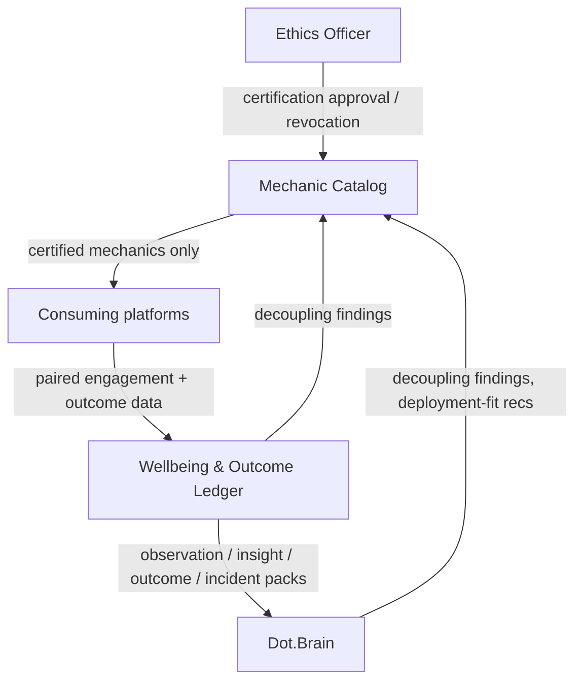

# Dot.Dopemine

Purpose: this is Dot.Dopemine's own knowledge home — owned and maintained by the Dot.Dopemine team. It describes what this platform is, what it offers, and how it connects to the wider Dot Ecosystem. Dot.Brain never edits this file; it only reads what we choose to publish.

> **Related:** [Dot.Brain's ingested view of this platform](https://github.com/sakhilebhayi/Dot.Brain/blob/main/platforms/dot-dopemine.md)

---

## 1. What Dot.Dopemine Is

Dot.Dopemine is the ecosystem's engagement and motivation platform: a catalog of progress surfaces, recognition mechanics, and habit-scaffolding tools that other platforms deploy *as a service*, rather than building their own ad-hoc engagement hacks. It exists so that "make this feature more engaging" has a single, accountable, ethically-audited answer instead of twenty different platforms independently reinventing streaks and leaderboards — some of them badly.

**Status:** early-stage. This repository does not yet contain application code; this wiki is the architecture blueprint the implementation will follow. Treat every section below as design intent, not shipped behavior, until the change log says otherwise.

## 2. Design Principle: We Are the Thing We Constrain

Dot.Dopemine carries the highest governance stakes of any platform in the fleet, because its literal product is the mechanism the ecosystem exists to keep in check. We do not get an exemption from that constraint — we get the strictest possible reading of it. Two rules follow directly:

1. **Never optimize for addiction or screen time.** We optimize for learning, achievement, mastery, business growth, productivity, community, purpose, confidence, momentum, and progress — never for attention captured for its own sake.
2. **The acid test applies to what we *offer*, not just what we deploy.** Every platform in the ecosystem is expected to ask "would I show this mechanic to the person it targets, with its intent labeled?" before shipping it. Dot.Dopemine has to answer that question for every mechanic in its catalog *before it's offered to anyone* — there is no "let the consuming platform decide" escape hatch. A mechanic that fails the test doesn't get certified, full stop. Offering a dark pattern and letting someone else deploy it is still manufacturing a dark pattern.

If a mechanic increases engagement without moving the outcome it's supposed to serve, that's not a success — that's the exact failure mode this platform is built to catch. See §7.

## 3. Architecture

Three moving parts, deliberately kept small:

- **Mechanic Catalog** — the certified inventory of engagement mechanics (progress bars, milestone recognition, mastery paths, etc.), each carrying a recorded acid-test verdict and a revocable certification status.
- **Wellbeing & Outcome Ledger** — the record that every mechanic deployment is measured in *pairs*: engagement movement is never published or acted on alone, only alongside the outcome metric it was meant to serve.
- **Ethics gate** — certification and decertification require Ethics Officer sign-off; this isn't a workflow nicety, it's the mechanism that keeps the catalog honest.

## 4. Domain Entities

| Entity | Natural key | Notes |
|---|---|---|
| Engagement mechanic | `mech:<name>` | Catalog entry; carries a recorded acid-test verdict |
| Deployment | mechanic + consuming platform | A mechanic live on a specific platform |
| Wellbeing observation | mechanic + cohort + window | Aggregate only, n ≥ 50 — never individual-level |
| Mechanic outcome | deployment + period | Outcome-metric movement paired with engagement movement, always together |
| Prohibited-metric entry | metric pattern | The negative catalog — patterns no platform may target (§7) |

## 5. Events Emitted

| Event | Trigger | Frequency |
|---|---|---|
| `engagement.mechanic.certified` | Acid-test verdict recorded, mechanic added to catalog | low |
| `engagement.mechanic.decertified` | Certification revoked (harm finding or decoupling) | low |
| `engagement.deployment.started` | A platform begins using a certified mechanic | low |
| `engagement.deployment.retired` | A platform stops using a mechanic | low |
| `engagement.prohibited_list.updated` | The prohibited-metric list changes | rare — mandatory subscription for all platforms |

## 6. What We Will Not Build

The prohibited-metric list is as much a part of this platform as the catalog is. It is not a compliance footnote — it's the flagship artifact, because it is where our restraint becomes legible to everyone else in the ecosystem. Patterns on the list, and why:

| Pattern | Why prohibited |
|---|---|
| Raw engagement volume as a target (dwell time, session count, opens) | Rewards attention captured, not outcomes achieved |
| Individual streaks with loss framing | Manufactures compulsion via loss aversion rather than progress |
| Person-vs-person leaderboards on rate metrics | Rewards speed over safety and quality |
| Variable-ratio reward schedules | Slot-machine mechanics — never deployed, blocked at catalog |
| Abandonment/re-engagement pressure nudges | Exploits incompleteness anxiety instead of genuine value |

Additions to this list go through Ethics Agent proposal and Ethics Officer approval. Removals require full governance review — deliberately harder than adding, because the default posture is caution. Every entry will cite the evidence or incident that put it there.

## 7. Our Own Dopamine Surface

The rule we apply to ourselves: we share our certified mechanics' real outcome performance and our own decoupling-finding counts — that's product honesty. We deliberately withhold "N platforms use our streaks" as a success metric, because counting adoption of our own engagement mechanics as a win is the engagement-as-outcome error, applied to ourselves. Our success metric is outcome movement on the platforms that deploy our mechanics, not how widely we're deployed.

## 8. Connecting to Dot.Brain

Dot.Dopemine participates in the ecosystem as a registered platform (`dot-dopemine`) that publishes Knowledge Packs about mechanic performance and wellbeing — always paired with the outcome the mechanic was meant to serve.

| Payload type | Cadence | Contains |
|---|---|---|
| `observation` | monthly | Mechanic outcome/engagement pairs, per deployment |
| `insight` | per finding | Mechanic effectiveness or harm findings |
| `outcome` | per verified deployment | Deployment verification against a counterfactual |
| `incident` | per incident | Mechanic-harm findings, decertifications |

Publication rule unique to this platform: an observation pack pairing engagement movement with outcome movement is publishable; engagement movement *alone* is not — it matches a prohibited-metric pattern and validation rejects it at ingestion. We hold ourselves to the rule we publish for everyone else.

We subscribe to Dot.Brain's mechanic-retirement candidates (engagement up, outcomes flat) and deployment-fit recommendations (which certified mechanic suits a platform's outcome goal). Full manifest, entity/event mapping, and a worked publish→PR round-trip are maintained on the Brain side at [`platforms/dot-dopemine.md`](https://github.com/sakhilebhayi/Dot.Brain/blob/main/platforms/dot-dopemine.md) — that document is Dot.Brain's ingested view and is authoritative for integration mechanics; this wiki is authoritative for what Dot.Dopemine actually *is*.

## 9. Roadmap

- [ ] Stand up the Mechanic Catalog with the acid-test verdict recorded per entry
- [ ] Implement the Ethics Officer certification/decertification workflow
- [ ] Build the paired engagement/outcome measurement pipeline (reject-at-ingestion for unpaired engagement metrics)
- [ ] Publish the first `observation` Knowledge Pack (hello-pack per Dot.Brain's onboarding procedure)
- [ ] Implement mandatory prohibited-metric-list distribution to all consuming platforms
- [ ] Build the mechanic-retirement review workflow (decoupling findings → retirement candidates)

## Change Log

| Version | Date | Author | Change |
|---|---|---|---|
| 0.1.0 | 2026-08-01 | Dopemine Platform Lead | Initial wiki: architecture blueprint derived from Dot.Brain's platforms/dot-dopemine.md, adapted to platform-owned framing |

## Open Questions

- Should prohibited-list enforcement rejections be surfaced to the offending platform's human lead automatically, or batched into governance review?
- End-user-visible intent labels: standard wording per persona token set, coordinated jointly with Dot.Design (Dopemine certifies the mechanic, Design certifies the label) — pending implementation.
- Where does the line sit between "recognition mechanic" and "gamification for its own sake" when a consuming platform requests a custom variant of a certified mechanic?
